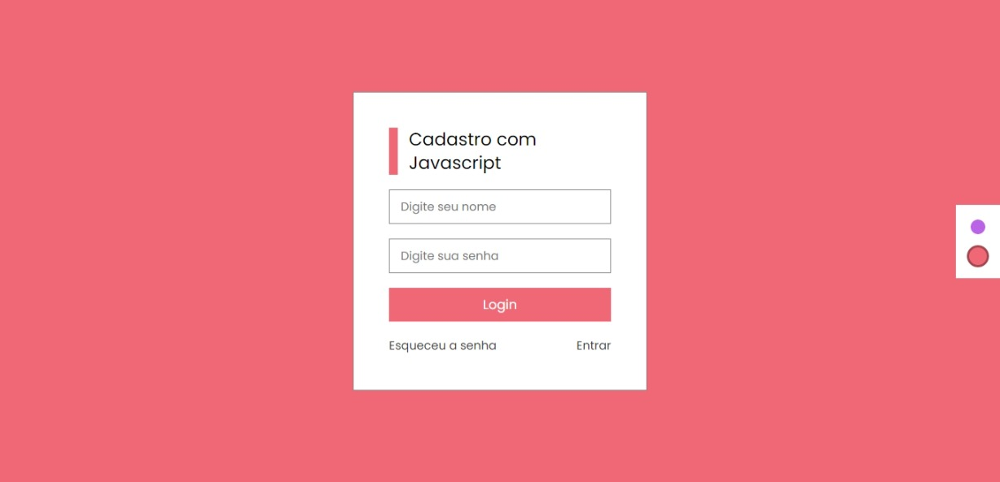
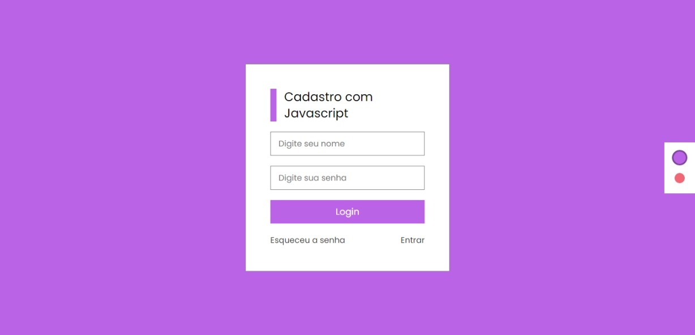

<h1>
        
</h1>

<h1>
        
</h1>
## 👩🏽‍💻 Sobre o projeto Página de Cadastro

Mas um projeto pronto com meu querido JAVASCRIPT. Foi desenvolvido uma página de Cadastro e com trocas de tema.

Este projeto é responsivo, adaptável a qualquer tamanho de tela.

## 👩🏽‍💻 Tecnologia Utilizada

O projeto foi desenvolvido com as seguintes tecnologias

- HTML

- CSS

- JAVASCRIPT

## 👩🏽‍💻 Acesse o projeto

 <h3>
        <a href="https://lyrisnunes.github.io/formulario-trocadetema/"> - Veja o projeto clique aqui </a>
</h3>